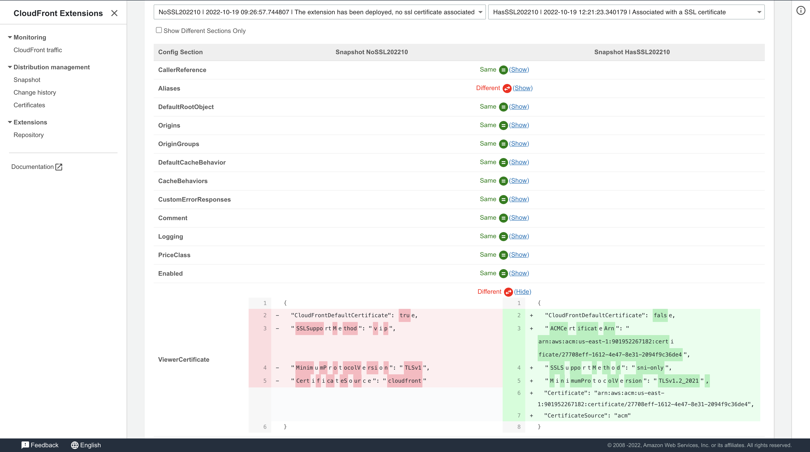
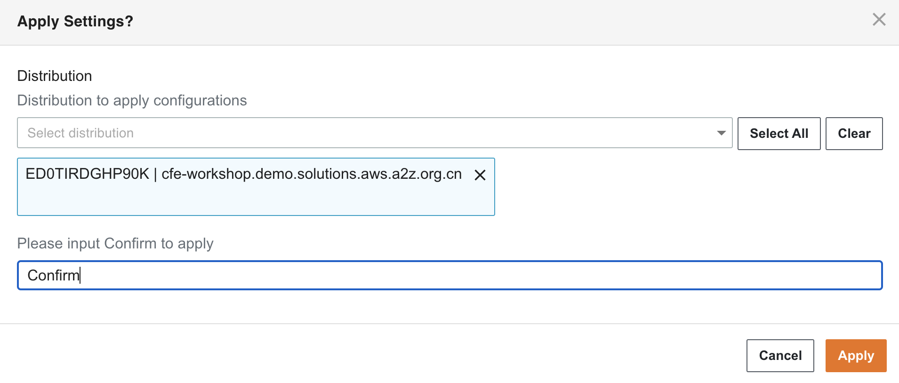
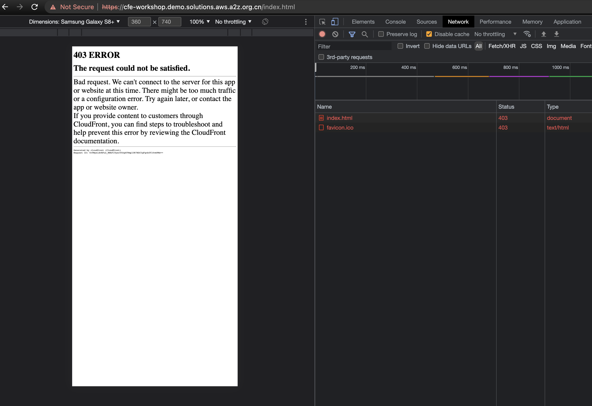

In last section, you associated a SSL certificate with the sample website and add an alternative domain name. The CloudFront distribution is changed, you can see the config difference and rollback the changes using snapshot.

## View configuration difference

1. Navigate to CloudFront Extensions console (you can find the link in the **Outputs** tab of **cloudFrontExtensionsConsole** stack).
2. In the navigation panel, under **Distribution management**, choose **Snapshot**.
   

3. Choose the **sample website distribution** (you can find it in Outputs tab of **CFExtSampleWorkshop** stack).
4. Choose **Create Snapshot**.
5. In the window that pops up, enter a Snapshot Name (a unique key used to identify this snapshot), and also description.
6. Choose **Create**.
   

7. Click Refresh button to see the newly created snapshot.
   

8. Choose these two snapshots, click **Actions > Compare** to see the difference between the snapshots.
   

9. The differences are shown in red, you can see there are two differences, the above one is **Alias**, the below one is **ViewerCertificate**.
   

## Rollback configuration

1. Go back to snapshot list page.
   

2. Choose the first snapshot to rollback, click **Actions > Apply to other distributions**.
   

3. Select the sample website distribution (you can find it in Outputs tab of **CFExtSampleWorkshop** stack). Type in **Confirm** and click **Apply** button.
   

4. Go to [CloudFront console](https://us-east-1.console.aws.amazon.com/cloudfront/v3/home?region=us-east-1#/distributions).
5. Choose the sample website distribution.
6. The distribution status is **Deploying** since you have applied the snapshot to it.
   

7. Wait until the distribution **Last modified** field changed from **Deploying** to a specific date time.

8. Access the sample website with your domain name again. It will show messages like this. The sample website can't be accessed by your domain name since you have rollback the configuration. But you can still access it by CloudFront domain name (xxx.cloudfront.net).
   

## Summary

In this section, you viewed the difference between two snapshots and rollback the configuration of the sample website. By using snapshot, you can easily rollback or copy CloudFront configuration.

!!! Important "Important"
    When you apply a snapshot, the target distribution configuration will be replaced.

