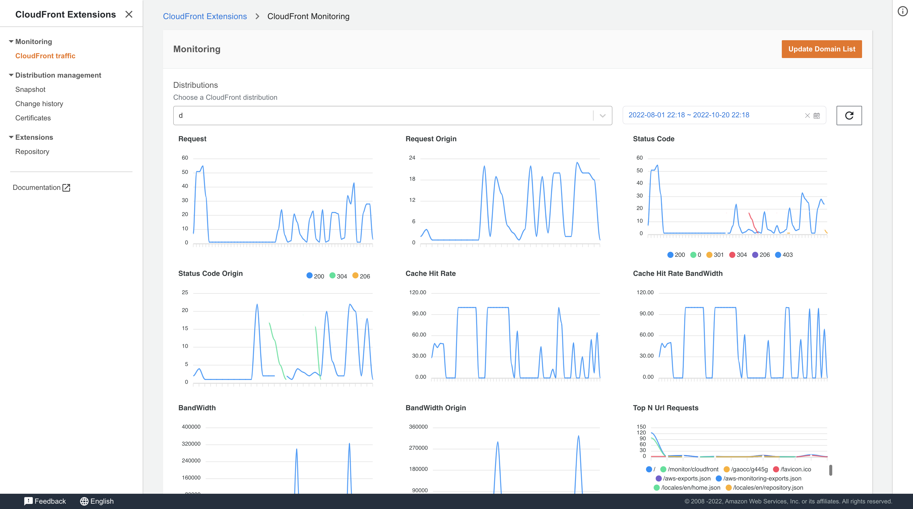

CloudFront Extensions provides two kinds of monitoring: non-real time monitoring and realtime monitoring. You can choose one of them to deploy and use it to view CloudFront traffic metrics via built-in metrics dashboard or via API calls. The dashboard uses CloudFront standard log or realtime log to get the metrics.

1. Go to CloudFront Extensions console.
2. In the navigation panel, under **Monitoring**, choose **CloudFront traffic**.
2. Choose the sample website distribution (you can find its domain name in **CFExtSampleWorkshop** stack), select a time range when the sample website has traffic.
   
3. Click **Refresh** button. You will see the metrics in the dashboard.
  

## Summary

In this section, you viewed the sample website traffic on CloudFront Extensions console. You can choose to view other CloudFront distributions metrics by click **Update Domain List** as well. The monitoring requirement (R4 in below table) has been meet.

| ID | Description  | Category                   | Status |
|----|------------------------------------------------------------------------------------------------------------------------------------------------------------------------------------------------------------------------------------------------------------------------------------|----------------------------|--------|
| R1 | It shows different web pages according to the user's browser type, for example, it redirects to page A when the user access it in PC browser, it redirects to page B when the user access it in Android browser, it redirects to page C when the user access it in iPhone browser. | Functional requirement     |    :heavy_check_mark:    |
| R2 | The configuration of CloudFront distribution need to be saved, so that it can rollback if it has issues in production environment.                                         | Non-functional requirement     |     :heavy_check_mark:   |
| R3 |      The website needs to have a CName (alternative domain name such as www.amazon.com) instead of xxx.cloudfront.net.                                                                                                                                          | Functional requirement |   :heavy_check_mark:     |
| R4 | After the website is launched, you need to monitor the metrics such as request number, back-to-origin bandwidth, top url.           | Non-functional requirement |   :heavy_check_mark:     |

Congratulations :tada:
You have completed all the tasks to meet the requirements.

